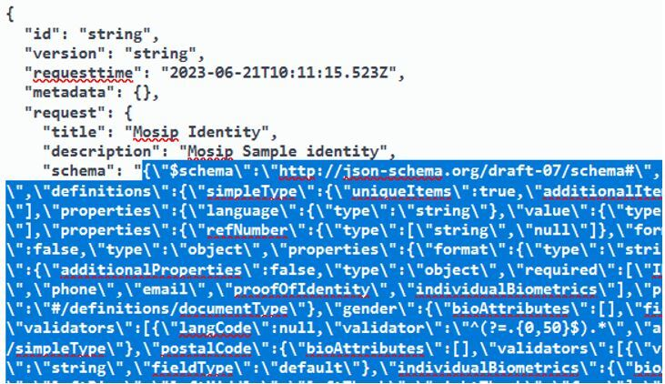
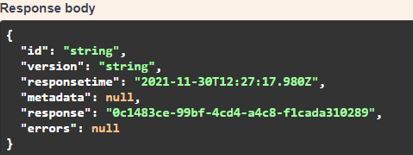

# Publishing an ID Schema 

The [Identity Schema](https://docs.mosip.io/1.2.0/id-lifecycle-management/id-schema) is a core configuration of MOSIP’s modularity. It allows the adopters to configure the important attributes of the identity system. All the user data that needs to be stored on the generation of a UIN is defined here. The schema implements the [JSON Schema Standard](http://json-schema.org/draft-07/schema#) and allows you to customize specifically to your requirements. Identity schema specifies the set of attributes and their allowed types. The identity schema is validated by the Identity Repository before storing the data for the registered users. Through schemas, you can also define additional fields that can be added to a user’s repository, such as the marital status, blood group, or preferred language.

The Identity Schema not only defines the data model of your identities, but also controls the business logic and allows you to:

* Define which field is used as the identifier when logging in: username, email, phone number, or a combination of those.
* Define the fields that are used to verify or recover the user's identity: email, phone number, or a combination of those.

Depending on your setup, you can benefit from defining different identity schemas for different groups of users, such as schemas for customer support and end users. This allows the adopters to tailor the user experience and also consider the security measures to meet specific requirements of each group.

The [MOSIP sandbox](https://docs.mosip.io/1.2.0/sandbox-details) comes with its default ID Schema (in Master DB, `identity_schema` table).

Below is a sample `identity-schema.json` file:


**Step 1 : Authenticate using APIs**

1.	Open Swagger, access the following link (add the exact env name in the link below):
  
   ```
      https://api-internal.<<add the environment name>>.mosip.net/v1/authmanager/swagger-ui/index.html?configUrl=/v1/authmanager/v3/api-docs/swagger-   
      config#/authmanager/clientIdSecretKey
   ```

2. Select `authenticate/clientidsecretkey` API.

   

3. Click **Try it out** to proceed.
   
   Edit the value with the below credentials from Keycloak:
   ```
   "
   "clientId": "mosip-admin-client",
    "secretKey": "<<get the secrete key from rancher>>",
   "appId": "admin"
   "
   ```

   

4. After editing, click on **Execute**, and make sure the response is success as shown below:

   

5. By this, the authentication process is completed successfully.

**Step 2 : Modify the ID Schema**

1. Take the sample `ID Schema.json` that is available and modify it.

2.	The schema can be modified to match your needs.
   
   For e.g.: Below is the sample `ID Schema.json` file with additional field to capture blood group.

   

3. Convert the modified `ID Schema.json` to a string.

4. To convert a JSON to a string, follow the steps mentioned below:
   a.	Use an online tool like [JSON Formatter & Validator ](https://jsonformatter.curiousconcept.com/#) to remove the spaces and make it compact (select “Compact” under Json template and “RFC8259” under Json specification).
   b.	Use an online tool. Refer [](https://onlinetexttools.com/json-stringify-text) or [](https://jsonformatter.org/json-stringify-online).
   c.	Paste the modified `ID Schema.json content` in the Input section.
   d.	Convert the JSON to string (stringify). 
   e.	Copy the stringified JSON.


**Step 3 : Create a draft ID Schema** 

1. Go to the link below (please add the exact env name and domain name in the link):

   ```
   https://api-internal.<<add the environment name>>.<<domain name>>/v1/masterdata/swagger-ui/index.html? url=/v1/masterdata/v3/api-docs#/schema-controller/createSchema
   ```
2.	Select POST `/idschema`.

3. Select **Try it out**.
   
4.	Paste the stringified ID schema in "schema": <<paste the id schema here>> as below:

   

5. Click **Execute** and make sure to get a successful response.

   

6. Take a note of the `response.id` in response.


**Step 4: Publish the ID Schema** 

1. Go to the link below and add the exact env name in the link:
   
   ```
   https://api-internal.<<add the environment name>>.mosip.net/v1/masterdata/swagger-ui/index.html?url=/v1/masterdata/v3/api-docs#/schema-controller/publishSchema
   ```
2.	Select PUT `/idschema/publish` to publish the schema.

3.	Select the `Try it Out` option.
   
4.	Update the ID `request.id` to the `response.id` that was obtained from the earlier step.
   
5.	Update the time to the current UTC Date and time.

  	The time to be edited is highlighted below:

   

6. Click **Execute** to execute the changes and response should have no errors. This proves that the ID Schema is published internally to MOSIP.

   

7. Now, the ID Schema is updated successfully. After the schema is published, all the new registrations would use this schema (In Registration Client, this will happen only after the sync).

To know more about ID schema, refer [here](https://docs.mosip.io/1.2.0/id-lifecycle-management/id-schema).

Content credits: MOSIP QA team
