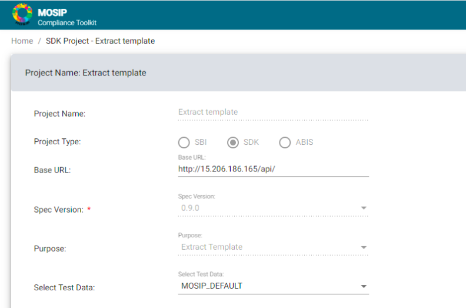

A partner can test both their `JAR` based or `docker service` based biometric SDKs with MOSIP's Compliance Tool kit. In this document, we have provided the steps that can be followed by the partner to enable the testing of both these solutions.

## Test using a SDK JAR

Partners having SDK JARs can test their biometric SDK JARs using Compliance Tool kit, by wrapping their SDKs in MOSIP’s BioSDK Services which provides REST endpoints to interact with the SDK jar.

* Checkout MOSIP’s Bio SDK Services from `https://github.com/mosip/biosdk-services.git`. Make sure to checkout the code from **develop** branch.
* Build the code with command `mvn clean install -Dgpg.skip`.
* After the build is successful, place your SDK jar in the `biosdk-services\biosdk-services\lib` folder.
* Create a bat file to run `biosdk-services`.
  
  ```
  cd <LOCAL_PATH>\biosdk-services\target
  java -Dloader.path=../lib/<SDK_JAR_NAME> -Dbiosdk_bioapi_impl=io.mosip.mock.sdk.impl.SampleSDK -jar biosdk-services-1.2.1-SNAPSHOT.jar
  ```
  Here, the `LOCAL_PATH` is the installation directory path for the Bio SDK Service and `SDK_JAR_NAME` is the SDK JAR name.

* Once the Bio SDK Service is running, check if the JAR is working using the Swagger available at URL: `http://localhost:9099/biosdk-service/swagger-ui.html`
* In Compliance Tool kit, for the SDK project, configure the `BASE_URL` as: `http://localhost:9099/biosdk-service`.


## Test using docker service

Partners having SDK docker service can test their SDKs using Compliance Tool kit by running their docker service to provide REST API’s to access SDK methods.

Once the docker is deployed and accessible, the partner needs to add the correct URL in the SDK project to access the docker service directly.



_Note_:The partner may face the CORS issue. To get around this, they can allow the Compliance Tool kit URL in their controllers using `@CrossOrigin("<URL>")` annotation.

Otherwise, a proxy service can be used, which would redirect all the calls to the docker.
