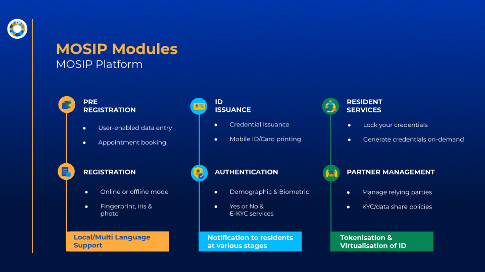
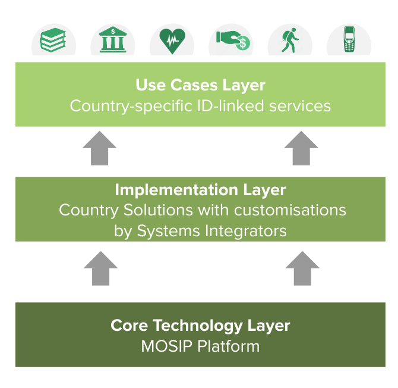

# Overview

### What is a Foundational Identity?

A **Foundational Identity System** provides individuals with a unique identifier issued by the government, enabling identity assertion and verification across multiple services. Unlike functional IDs, which are designed for specific use cases such as healthcare, finance, and social services, foundational IDs serve as a universal framework that various sectors can leverage.

MOSIP empowers governments to build **secure, interoperable,** and **inclusive** foundational ID systems. With robust privacy protections and modular architecture, MOSIP ensures individuals have control over their personal information while enabling seamless access to public and private services.

Below is a diagram illustrating the relationship between **Foundational IDs** and **Functional IDs**.

* **Foundational ID systems** provide individuals with a **unique, government-recognized identifier** for identity verification. They help **de-duplicate** records, **authenticate** individuals, and **verify** identity attributes.
* **Functional IDs** are sector-specific and designed for specific use cases such as **healthcare, finance, social protection, education, and voting**. These IDs can leverage the foundational ID system to ensure accuracy, efficiency, and seamless service access.

This structure helps create a **secure and interoperable identity ecosystem** for both public and private services.

<figure><figcaption></figcaption></figure>

### What is MOSIP?

[MOSIP (Modular Open-Source Identity Platform)](https://www.mosip.io/#1) is a secure, scalable, and open-source framework designed to help governments and organizations build foundational identity systems. It offers a flexible and configurable approach, allowing countries to tailor their national ID systems to meet specific requirements while ensuring privacy, security, and interoperability.

The below image illustrates MOSIP as a modular, open-source identity platform designed for secure and scalable digital identity systems. It highlights key features such as interoperability, open standards, security, and privacy, ensuring seamless integration without vendor lock-in.

Additionally, it showcases MOSIP’s core functionalities, including ID issuance, identity verification, and lifecycle management, making it a flexible solution for national ID implementations.

<figure><figcaption></figcaption></figure>

### Privacy and Security

The image below highlights MOSIP’s security and privacy principles, emphasizing its "Security by Design" and "Privacy by Intent" approach.

These principles align with MOSIP’s Privacy and Security framework.

For more details, please refer to [Privacy and Security](https://docs.mosip.io/1.2.0/readme/principles/privacy-and-security) section. To learn more about MOSIP’s Principles, [click here](https://docs.mosip.io/1.2.0/readme/principles).

<figure><figcaption></figcaption></figure>

### MOSIP Modules

The image below illustrates the various MOSIP Modules:

* Pre-Registration – Enables users to provide basic demographic data and book appointments for registration.
* Registration – Facilitates registration of an individual, for availing a Unique Identification Number (UIN) by providing demographic and biometric data (fingerprint, iris, and face photograph) in online/offline mode.
* Registration Processor – Generates a Unique Identification Number (UIN) post a regulated process and enriches data.
* ID Authentication – Provides demographic and biometric authentication services, including Yes/No and E-KYC services, enabling access to a myriad of rights and services.
* Resident Services – Allows residents to update and monitor usage of their IDs, giving individuals control over their own identity.
* Partner Management – For onboarding, managing, and integrating external partners (relying parties) within the MOSIP ecosystem.

To learn more about the MOSIP modules, please refer [here](https://docs.mosip.io/1.2.0/id-lifecycle-management).

<figure><figcaption></figcaption></figure>

### MOSIP Ecosystem

MOSIP collaborates with ecosystem partners to develop tailored identity solutions for each country.

The diagram below illustrates the **MOSIP Ecosystem**, highlighting how various components integrate with the **MOSIP Platform** to deliver a comprehensive ID solution.

To learn more about the MOSIP Ecosystem, please refer [here](https://docs.mosip.io/1.2.0/id-lifecycle-management/support-systems/partner-management-services/partners).

<figure><figcaption></figcaption></figure>

### MOSIP's Offerings

The diagram illustrates **MOSIP’s Key Offerings** in **ID Lifecycle Management** and **ID Authentication**, highlighting two main processes:

**1. ID Registration Process**

* Step 1: Online Pre-Registration – A resident submits demographic details online.
* Step 2: Biometric Enrollment – The resident visits a registration center for biometric data collection.
* Step 3: ID Issuance – After successful validations and processing, the resident receives a Unique Identification Number (UIN).

**2. ID Authentication Process**

* An ID holder requests authentication to access services.
* Authentication is performed via an authentication partner equipped with biometric or digital verification tools.
* The MOSIP Authentication System validates the identity, providing eKYC or token-based responses for service access.

These offerings enable secure, scalable, and modular identity management and authentication solutions.

### Building a National ID System Using MOSIP

Countries can leverage MOSIP as the base identity platform and configure, customize, and extend it to build systems just the way needed.

The image below depicts how MOSIP provides the base layer to build a national ID platform.

