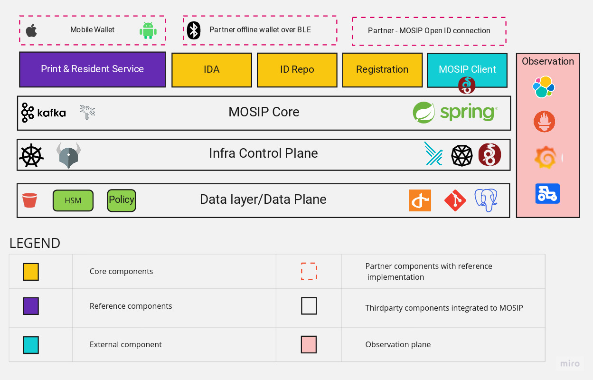
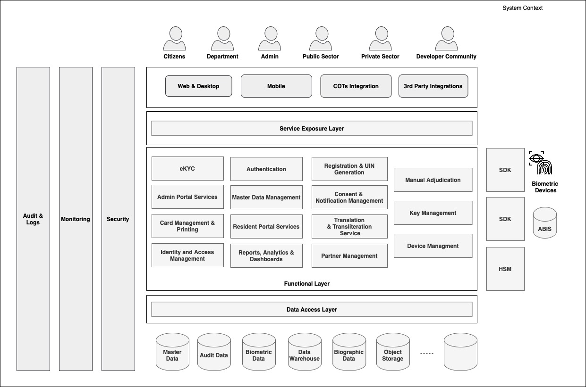

# Architecture

MOSIP is built on a modular, microservices-based architecture. Its modularity enables seamless adoption even in complex scenarios. Most [MOSIP modules](../../modules.md) are designed as robust foundational infrastructure components, making them suitable for integration into various projects.

MOSIP is designed with the following architectural principles. These architecture principles are core to the development of the system's features and have a great influence on how and why specific software design patterns are used within.

* Data Privacy
* No Vendor Lock-in
* Open Standards
* Async/ Offline First
* Commodity Computing
* Fault tolerant
* Manageable
* Secure By Default

### Architecture Overview

The diagram below provides an architectural overview, visually representing the components of the MOSIP Identity framework and its associated technology stack.

<figure><figcaption>
Architecture Overview
</figcaption></figure>

### High Level Functional Architecture

The High Level Reference Functional Architecture serves as a blueprint outlining the system's high-level functioning and interactions, providing a structured framework.

<figure><figcaption>
High Level Reference Functional Architecture
</figcaption></figure>

To know how MOSIP can be deployed, refer to [Getting Started](https://docs.mosip.io/1.2.0/deploymentnew/getting-started). The different installation models are detailed in the [Deployment](https://docs.mosip.io/1.2.0/deploymentnew) section.
