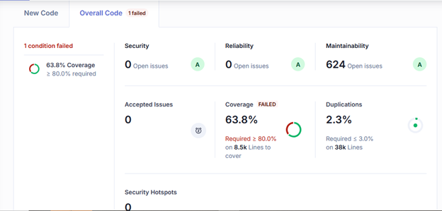
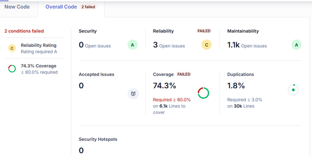
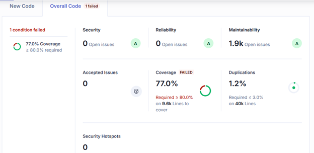

# Test Report

## Testing Scope

The scope of testing is to verify fitment to the specification from the perspective of&#x20;

●     Functionality&#x20;

●     Deployability&#x20;

●     Configurability&#x20;

●     Customizability

Verification is performed not only from the end user perspective but also from the System Integrator (SI) point of view. Hence Configurability and Extensibility of the software are also assessed. This ensures the readiness of software for use in multiple countries. Since MOSIP is an “API First” product platform, the Verification scope required comprehensive automation testing for all the MOSIP APIs. An automation Test Rig is created for the same.

The testing scope revolves around the following flows:

●     IDA

●     ID Repo

●     Resident Services

●     DSL

## Test Approach 

Persona based approach has been adopted to perform the IV\&V, by simulating test scenarios that resemble a real-time implementation.

A Persona is a fictional character/user profile created to represent a user type that might use a product/or a service in a similar way. Persona based testing is a software testing technique that puts software testers in the customer's shoes, assesses their needs from the software, and thereby determines use cases/scenarios that the customers will execute. The persona's needs may be addressed through any of the following.

●     Functionality&#x20;

●     Deployability&#x20;

●     Configurability&#x20;

●     Customizability

&#x20;The verification methods may differ based on how the need was addressed.

&#x20;For regression check, “MOSIP Test Rig” - an automation testing suite - is indigenously designed and developed for supporting persona-based testing. MOSIP Test Rig covers authenticating identity using IDA through various permutations and combinations of cases being covered, ID Repo, and Resident Services. MOSIP Test Rig will be an open-source artifact that can also be enhanced and used by countries to validate the SI deliveries before going live. Persona classes include both negative and positive personas. Negative persona classes include users like Bribed Registration Office, Malicious Insider, etc. The needs of positive persona classes must be met, whereas the needs of negative persona classes must be effectively restricted by the software.&#x20;

## Verified configuration 

Verification is performed on various configurations as mentioned below

&#x20;    ●        Default configuration - with 3 Lang (English/French/Arabic)

&#x20;                    ○        But for testing we only performed testing in English for IDA and ID Repo

&#x20;                    ○        For Resident testing we performed in English, French, and Arabic.&#x20;

## Test execution statistics 

### Functional test results by modules 

Below are the test metrics for IDA, ID Repo, and Resident service for API.

#### API Test Rigs :&#x20;

<table><thead><tr><th valign="top">Total</th><th valign="top">Passed</th><th valign="top">Failed</th><th valign="top">Skipped</th><th valign="top">Ignored</th></tr></thead><tbody><tr><td valign="top">2046</td><td valign="top">1943</td><td valign="top">15</td><td valign="top">0</td><td valign="top">88</td></tr></tbody></table>

**Test Rate:** 95%  With **Pass Rate:** 99%

Here is the detailed breakdown of metrics for each module:

#### IDA:

<table><thead><tr><th valign="top">Total Test Cases</th><th valign="top">Passed</th><th valign="top">Failed</th><th valign="top">Skipped</th><th valign="top">Ignored</th></tr></thead><tbody><tr><td valign="top">512</td><td valign="top">496</td><td valign="top">12</td><td valign="top">0</td><td valign="top">4</td></tr></tbody></table>

#### ID Repo:

<table><thead><tr><th valign="top">Total Test Cases</th><th valign="top">Passed</th><th valign="top">Failed</th><th valign="top">Skipped</th><th valign="top">Ignored</th></tr></thead><tbody><tr><td valign="top">410</td><td valign="top">325</td><td valign="top">1</td><td valign="top">0</td><td valign="top">84</td></tr></tbody></table>

#### Resident:

<table><thead><tr><th valign="top">Total Test Cases</th><th valign="top">Passed</th><th valign="top">Failed</th><th valign="top">Skipped</th></tr></thead><tbody><tr><td valign="top">1124</td><td valign="top">1122</td><td valign="top">2</td><td valign="top">0</td></tr></tbody></table>

* In IDA the Ignored 4 test cases are related to Generating VID using ID Repo API. So, this feature is not supported/needed. Currently, to generate VID we are using Resident API.
* In ID Repo we have 84 test cases in Ignored, they are all for “array of handles” test cases and Add identity test cases, for now, we are ignoring them.

Functional and test rig code base branch which is used for the above metrics is:

#### Hash Tag:

`sha256:fa7ec4181c78018e5ac8cdf148f59c905bb2973a6052c10673d8302aa9912d75`

### DSL Report

<table><thead><tr><th valign="top">Total Test Cases</th><th valign="top">Passed</th><th valign="top">Failed</th><th valign="top">Skipped</th></tr></thead><tbody><tr><td valign="top">183</td><td valign="top">145</td><td valign="top">38</td><td valign="top">0</td></tr></tbody></table>

The DSL codebase used for the above result is the **dev2** image (`mosipdev2/dsl-orchestrator:develop`).

**Hash Tag:**\
`SHA-256: e2bc90ec585b1dcf49d9a468fa8fecf94e48e2aab06dcf71c97f1663c5f12f31`

### Detailed Test metrics

Below are the detailed test metrics by performing manual/automation testing. The project metrics are derived from Defect density, Test coverage, Test execution coverage, test tracking, and efficiency.

The various metrics that assist in test tracking and efficiency are as follows:

●   Passed Test Cases Coverage: This measures the percentage of passed test cases. (Number of passed tests / Total number of tests executed) x 100.

●   Failed Test Case Coverage: It measures the percentage of all the failed test cases. (Number of failed tests / Total number of test cases executed) x 100.

Please find the Github link for the xls file [here](https://github.com/mosip/test-management/blob/master/Platform%20release/1.2.1.0-B1%20Phase%203/Java21_Component_ReleasePLatform%201.2.1.0-B1%20Phase%203_Functional_Test_Report.docx).

### Sonar Report 

**ID - Authentication**

<figure><figcaption>
<strong>ID - Authentication</strong>
</figcaption></figure>

**ID - Repo**

<figure><figcaption>
<strong>ID - Repo</strong>
</figcaption></figure>

**Resident**

<figure><figcaption>
<strong>Resident</strong>
</figcaption></figure>
