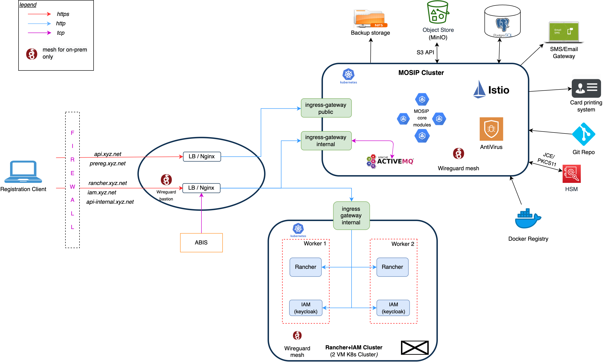

# On-prem Cluster Setup

## Overview
This is a guide to set up on-prem Kubernetes cluster that will host all the MOSIP modules.



## Prerequisites
- [Hardware requirements](./requirements.md#Hardware-requirements).
- [Network configuration requirements](./requirements.md#Network-configuration).
- [Certificate requirements](./requirements.md#Certificate-requirements).
- [Rancher](../../rancher) installed.
- Following command line utilities installed:
  - `kubectl`
  - `helm`
  - `rke`
  - `istioctl`
- Following Helm repos added:
  ```sh
  helm repo add bitnami https://charts.bitnami.com/bitnami
  helm repo add mosip https://mosip.github.io/mosip-helm
  ```

## Cluster setup
* Set up VMs.
* Using this [RKE Cluster Creation](../../docs/rke-setup.md) document, create a K8s cluster.

## Istio for service discovery and ingress
* Navigate to [istio](./istio/) folder in the same directory.
* Edit the `install.sh` and `iop.yaml` accordingly and install it.
  ```
  KUBECONFIG="$HOME/.kube/mosip_cluster.config"
  ./install.sh
  ```
* This will bring up all istio components and the ingress-gateways.
* Check inressgateway services using;
  ```
  kubectl get svc -n istio-system
  ```

## Global configmap

* Copy `../global_configmap.yaml.sample` to `../global_configmap.yaml`  
* Update the domain names in `../global_configmap.yaml` and run
```
kubectl apply -f ../global_configmap.yaml
```

## Nginx loadbalancer / Reverse Proxy

* Install [Nginx Reverse Proxy](./nginx/) on a seperate machine/VM, that proxies traffic to the above ingressgateways.

## Wireguard bastion setup

* Install [Wireguard Bastion Host](../../docs/wireguard_bastion.md) on a seperate machine/VM.

## DNS mapping

* Point your domain names to respective public IP or internal ip of the nginx node. Refer to the [DNS Requirements](./requirements.md#DNS_requirements) document and to your global configmap, to co-relate the mappings.

## Httpbin

* Install httpbin as given [here](../../utils/httpbin/README.md) for testing the wiring.

## Register the cluster with Rancher

* This section is for integrating the newly created mosip cluster with rancher.
* Assuming a rancher cluster is already installed, open that Rancher dashboard. Click on add cluster on top right.
* In the cluster type selection screen, at the top, there is an option to "import any other kubernetes cluster", select that.
* That should give two commands to run on the new cluster (the mosip cluster). After running those, the new cluster should be integrated into Rancher.
* Add members, atleast one as Owner.

## Longhorn
* Install Longhorn as given [here](../longhorn/README.md) for persistent storage.
